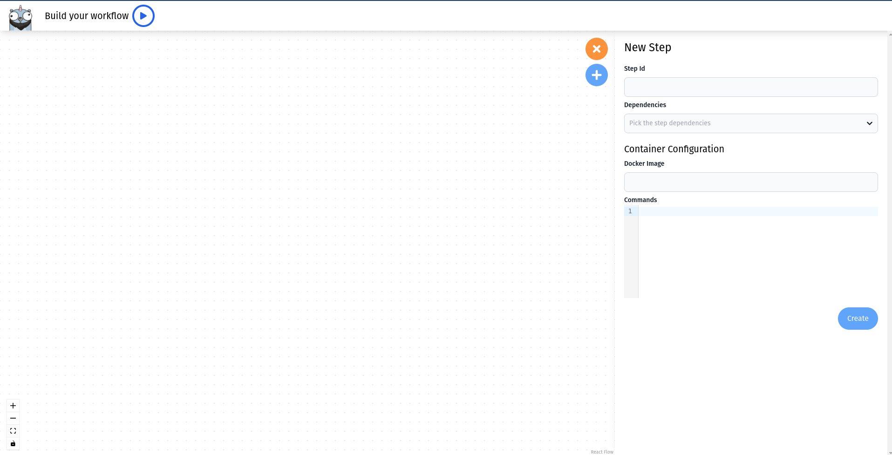

:::info
Selflow Webclient requires [Selflow-Daemon](./selflow-daemon) to run.
:::

The Selflow Webclient is an interface that communicates with the [Selflow Daemon](./selflow-daemon).
It allows the creation and execution of workflows in a visual interface.

## Installation

Like [Selflow CLI](./cli), the Webclient is not deployed because it is still in early stages and is not production ready.
To use it you can run it locally !
You only need to have a [node.js](https://nodejs.org/en) environment, [yarn](https://yarnpkg.com/getting-started/install) installed, [git](https://git-scm.com/downloads) and the [selflow daemon](/docs/ecosystem/selflow-daemon) running.

```bash
# Clone the repository
git clone https://selflow/selflow
cd selflow

# Install dependencies
yarn

## Build the dev server
yarn nx run webclient:build
cd dist/apps/webclient
yarn start
```

:::warning
Make sure to replace `selflow-daemon` with your docker image name / network
:::

## Usage



When you start the Webclient, you will arrive to this mage. Here you can start adding your first step in the right panel.

You can click on a created step, you can edit its information in the right panel (remember to save them with the button on the bottom)

You can add dependencies between steps with the dropdown in the form or by connecting steps on the interface.

When you are done with the form, you can click the blue play button on the top to start the run !

## Limitations

Currently the Webview only supports docker steps with the selflow daemon and does not support all fields.
It is still in active development. A complete version should be available in September 2023.
